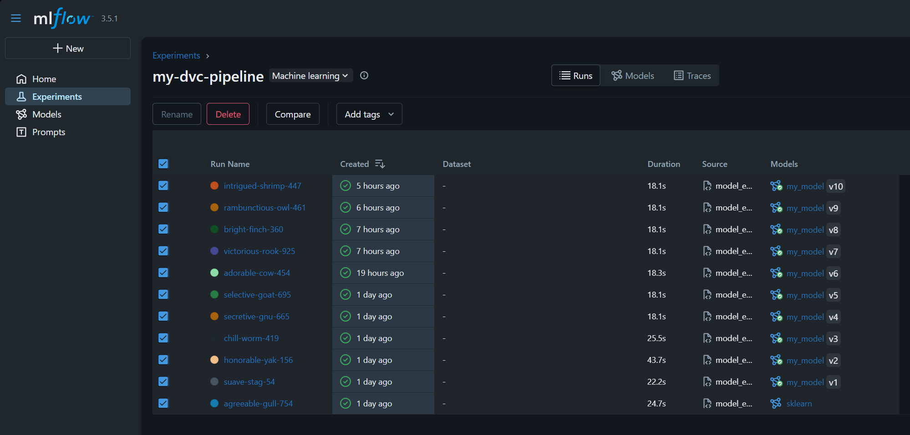
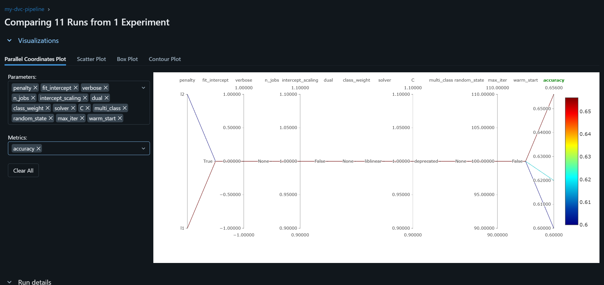
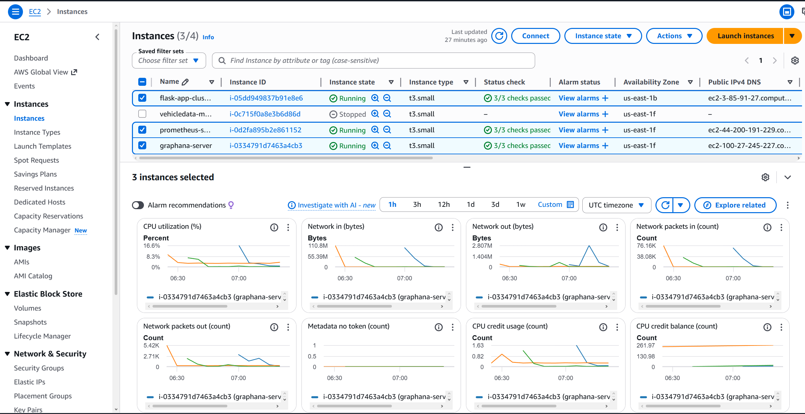
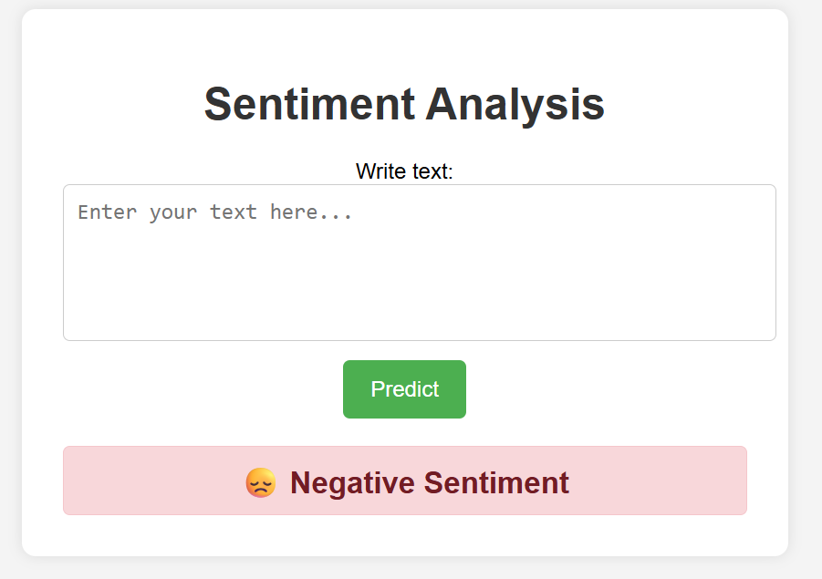
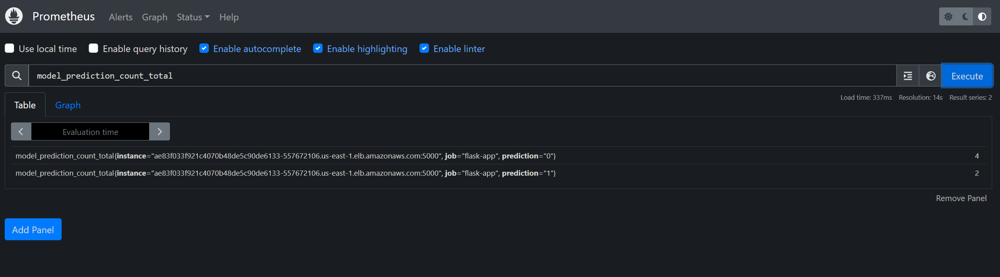
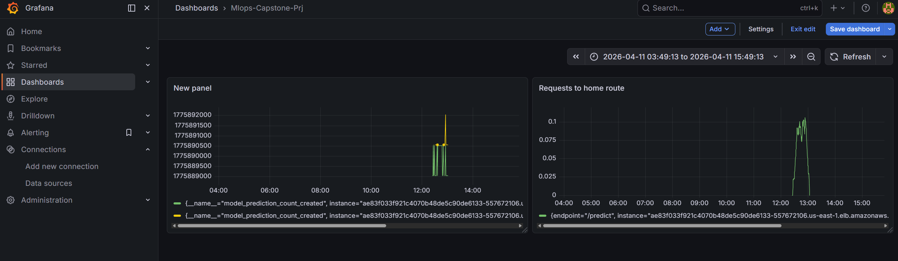

# MLOps Capstone Project — End-to-End Sentiment Analysis Pipeline


> **About this project:** This is an end-to-end **MLOps capstone** built around a simple sentiment-analysis model. The focus is **not the model's accuracy** — the model itself is intentionally lightweight. The entire value of this project is in the **MLOps lifecycle**: experiment tracking, data versioning, reproducible pipelines, CI/CD, containerized deployment to Kubernetes on AWS, and live monitoring.

---

## Table of Contents
- [Project Overview](#project-overview)
- [Tech Stack](#tech-stack)
- [AWS Services Used](#aws-services-used)
- [End-to-End Project Flow](#end-to-end-project-flow)
- [Architecture](#architecture)
- [CI/CD Pipeline](#cicd-pipeline)
- [Monitoring Stack](#monitoring-stack)
- [Screenshots](#screenshots)
- [Project Structure](#project-structure)
- [Running Locally](#running-locally)

---

## Project Overview

A text-based **sentiment analysis** Flask application wrapped inside a full MLOps workflow:

- Data and model artifacts are versioned with **DVC** (remote backed by **S3**).
- Experiments are tracked on **MLflow via DagsHub**.
- A multi-stage **DVC pipeline** handles ingestion → preprocessing → feature engineering → training → evaluation → registration.
- The Flask prediction service is **Dockerized**, pushed to **Amazon ECR**, and deployed to an **Amazon EKS** cluster via a **GitHub Actions** pipeline.
- Runtime metrics are scraped by a **Prometheus** server on EC2 and visualized via **Grafana** on another EC2 instance.

---

## Tech Stack

| Category | Tools |
|---|---|
| **Language & Framework** |   |
| **ML / NLP** |     |
| **Experiment Tracking** |   |
| **Data & Pipeline Versioning** |   |
| **Containerization** |  |
| **Orchestration** |    |
| **CI/CD** |  |
| **Monitoring** |   |
| **Cloud** |  |
| **Project Scaffold** |  |

---

## AWS Services Used

| Service | Purpose |
|---|---|
|  **Amazon S3** | Remote storage for DVC-tracked datasets, intermediate artifacts, and models |
|  **AWS IAM** | Programmatic access credentials and permissions (`AmazonEC2ContainerRegistryFullAccess`, S3 access) |
|  **Amazon ECR** | Private Docker registry hosting the `mlops-capstone-prj` image built in CI |
|  **Amazon EKS** | Managed Kubernetes cluster (`flask-app-cluster`) running the Flask prediction service |
|  **Amazon EC2** | Two Ubuntu `t3.medium` instances — one for Prometheus, one for Grafana |
|  **Elastic Load Balancer** | External LoadBalancer service exposing the EKS Flask app on port 5000 |
|  **Security Groups** | Inbound rules opened on 5000 (app), 9090 (Prometheus), 3000 (Grafana), 22 (SSH) |

---

## End-to-End Project Flow

### 1. Project Bootstrapping
- Repo scaffolded with the **Cookiecutter Data Science** template.
- Isolated **conda** environment (`atlas`, Python 3.10).
- Standard directory layout: `src/`, `notebooks/`, `data/`, `models/`, `reports/`, `tests/`, `scripts/`.

### 2. Experiment Tracking — MLflow on DagsHub
- DagsHub repo connected to GitHub.
- MLflow tracking URI points at DagsHub; auth handled via a `CAPSTONE_TEST` token stored as a GitHub Secret.
- Exploratory notebooks log runs, parameters, and metrics to the DagsHub-hosted MLflow server.

### 3. Data & Pipeline Versioning — DVC
Modular `src/` package:
- `src/data/data_ingestion.py`
- `src/data/data_preprocessing.py`
- `src/features/feature_engineering.py`
- `src/model/model_building.py`
- `src/model/model_evaluation.py`
- `src/model/register_model.py`
- `src/logger/` — shared logging

Orchestrated by `dvc.yaml` with parameters in `params.yaml`. The full pipeline runs reproducibly via `dvc repro`. Remote storage was migrated from a local folder (`local_s3/`) to a real **S3 bucket** once IAM credentials were configured.

### 4. Prediction Service — Flask
- `flask_app/app.py` loads the latest registered model from the MLflow Model Registry.
- `flask_app/preprocessing_utility.py` mirrors the training-time text normalization (lowercasing, stop-word removal, punctuation/number/URL stripping, lemmatization) to avoid train-serve skew.
- Routes: `/` (UI), `/predict` (POST), `/metrics` (Prometheus scrape endpoint).
- Exposes custom Prometheus metrics: `app_request_count`, `app_request_latency_seconds`, `model_prediction_count`.

### 5. Testing
- `tests/` and `scripts/` contain model and app tests executed in CI (model loading, signature checks, Flask route smoke tests).

### 6. Containerization — Docker
- `requirements.txt` inside `flask_app/` generated via `pipreqs`.
- Root-level `Dockerfile` builds the image.
- Image is built and tagged as `capstone-app:latest`, then pushed to ECR from CI.

### 7. CI/CD — GitHub Actions
The `.github/workflows/ci.yaml` pipeline runs on every push to `main` and performs:
1. Checkout + Python setup
2. Install dependencies
3. `dvc pull` from S3
4. Run unit/integration tests
5. Promote model in MLflow registry (Staging)
6. Build Docker image
7. Push image to **Amazon ECR**
8. Configure `kubectl` against the EKS cluster
9. `kubectl apply -f deployment.yaml` to roll out the new image

### 8. Kubernetes Deployment — Amazon EKS
Cluster created with:

```bash
eksctl create cluster \
  --name flask-app-cluster \
  --region us-east-1 \
  --nodegroup-name flask-app-nodes \
  --node-type t3.small \
  --nodes 1 --nodes-min 1 --nodes-max 1 \
  --managed
```

- `deployment.yaml` defines the Deployment + LoadBalancer Service.
- The Service provisions an **AWS ELB**; the external hostname is used to reach the app on port 5000.
- Node security group edited to allow inbound traffic on port 5000.

### 9. Monitoring — Prometheus + Grafana
- **Prometheus** on an Ubuntu `t3.medium` EC2 instance (port 9090). Its `prometheus.yml` scrapes the EKS LoadBalancer endpoint at `/metrics`.
- **Grafana** on a separate Ubuntu `t3.medium` EC2 instance (port 3000). Prometheus is added as a data source, and dashboards visualize request counts, latency histograms, and per-class prediction counts.

---

## Architecture

```
                ┌────────────────┐
                │   Developer    │
                └──────┬─────────┘
                       │ git push
                       ▼
                ┌────────────────┐       ┌──────────────────┐
                │ GitHub Actions │──────▶│  DagsHub / MLflow│
                │    (CI/CD)     │       │  (experiments &  │
                └──────┬─────────┘       │   model registry)│
                       │                 └──────────────────┘
          build/push   │   dvc pull
                       ▼
             ┌──────────────────┐
             │   Amazon ECR     │
             └──────┬───────────┘
                    │ pull image
                    ▼
             ┌──────────────────┐       ┌──────────────────┐
             │   Amazon EKS     │◀─────▶│    Amazon S3     │
             │  (Flask pod)     │       │ (DVC remote)     │
             └──────┬───────────┘       └──────────────────┘
                    │ LoadBalancer :5000
                    ▼
             ┌──────────────────┐
             │   End Users      │
             └──────────────────┘
                    ▲
                    │ scrape /metrics
             ┌──────┴──────────┐        ┌──────────────────┐
             │ Prometheus (EC2)│───────▶│   Grafana (EC2)  │
             └─────────────────┘        └──────────────────┘
```

---

## CI/CD Pipeline

| Stage | Tool | What happens |
|---|---|---|
| Source | GitHub | Trigger on push to `main` |
| Test | pytest + DVC | Pull data/models, run unit tests |
| Track | MLflow / DagsHub | Promote model to Staging |
| Build | Docker | Build `capstone-app` image |
| Publish | Amazon ECR | Push tagged image |
| Deploy | kubectl / EKS | Rolling update via `deployment.yaml` |

GitHub Secrets used: `AWS_ACCESS_KEY_ID`, `AWS_SECRET_ACCESS_KEY`, `AWS_REGION`, `AWS_ACCOUNT_ID`, `ECR_REPOSITORY`, `CAPSTONE_TEST` (DagsHub token).

---

## Monitoring Stack

**Custom application metrics** exported from Flask:

| Metric | Type | Description |
|---|---|---|
| `app_request_count` | Counter | Total requests per method/endpoint |
| `app_request_latency_seconds` | Histogram | Per-endpoint request latency |
| `model_prediction_count` | Counter | Count of predictions, labeled by class |

Prometheus scrape config target:
```yaml
scrape_configs:
  - job_name: "flask-app"
    static_configs:
      - targets: ["<eks-loadbalancer-hostname>:5000"]
```

---

## Screenshots

### MLflow (on DagsHub) — experiment runs


### MLflow — comparing runs across hyperparameters


### AWS EC2 — Prometheus & Grafana instances


### Prediction Web App (Flask on EKS)


### Prometheus — querying custom metrics


### Grafana — live dashboards


---

## Project Structure

```
MLOps-Capstone-Project/
├── .github/workflows/ci.yaml      # CI/CD pipeline
├── Dockerfile                     # Image for the Flask service
├── deployment.yaml                # Kubernetes Deployment + LoadBalancer Service
├── dvc.yaml / params.yaml         # DVC pipeline + hyperparameters
├── flask_app/
│   ├── app.py                     # Flask app with Prometheus metrics
│   ├── preprocessing_utility.py
│   ├── templates/                 # HTML UI
│   └── requirements.txt
├── src/
│   ├── data/                      # ingestion, preprocessing
│   ├── features/                  # feature engineering
│   ├── model/                     # training, evaluation, registration
│   └── logger/                    # shared logger
├── tests/                         # CI test suite
├── scripts/                       # test helpers / promotion scripts
├── notebooks/                     # EDA & experiments
├── models/                        # vectorizer.pkl, etc.
├── images/                        # screenshots used in this README
└── projectflow.txt                # step-by-step build log
```

---

## Running Locally

```bash
# 1. Create env
conda create -n atlas python=3.10 -y
conda activate atlas
pip install -r requirements.txt

# 2. Pull versioned data/models from S3
dvc pull

# 3. Run the DVC pipeline end-to-end
dvc repro

# 4. Start the Flask app (needs DagsHub token)
export CAPSTONE_TEST=<your-dagshub-token>
cd flask_app && python app.py
# → http://localhost:5000
```

### Run via Docker
```bash
docker build -t capstone-app:latest .
docker run -p 8888:5000 -e CAPSTONE_TEST=<your-dagshub-token> capstone-app:latest
```

---

## Note on Model Quality

The sentiment classifier itself is deliberately simple and **not optimized for accuracy** — the point of this capstone is to prove out the **operational** side of ML: reproducibility, versioning, automated deployment, and observability. Swapping in a stronger model would require zero changes to the pipeline, CI/CD, or deployment — which is exactly the MLOps goal.
